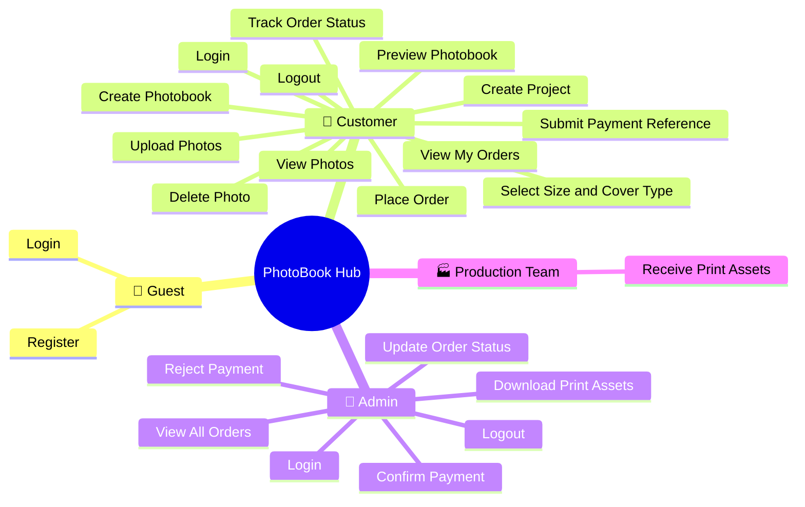
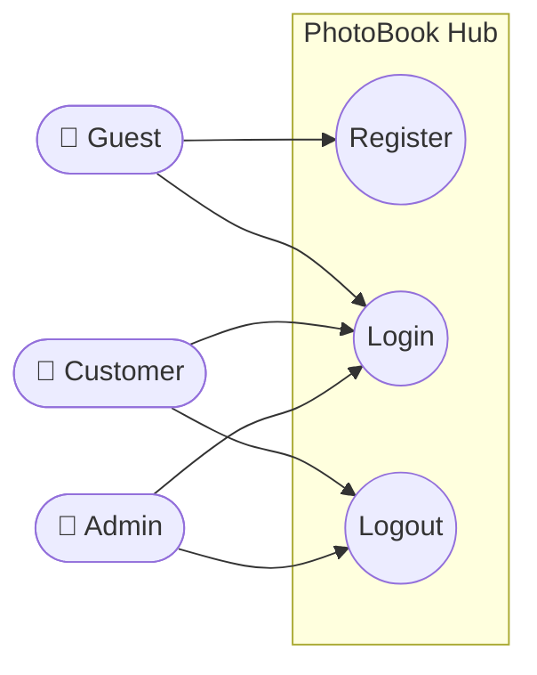
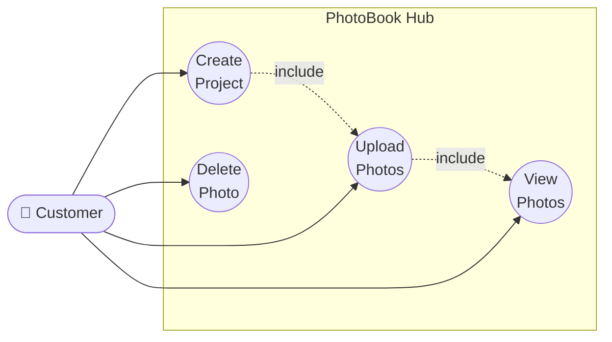
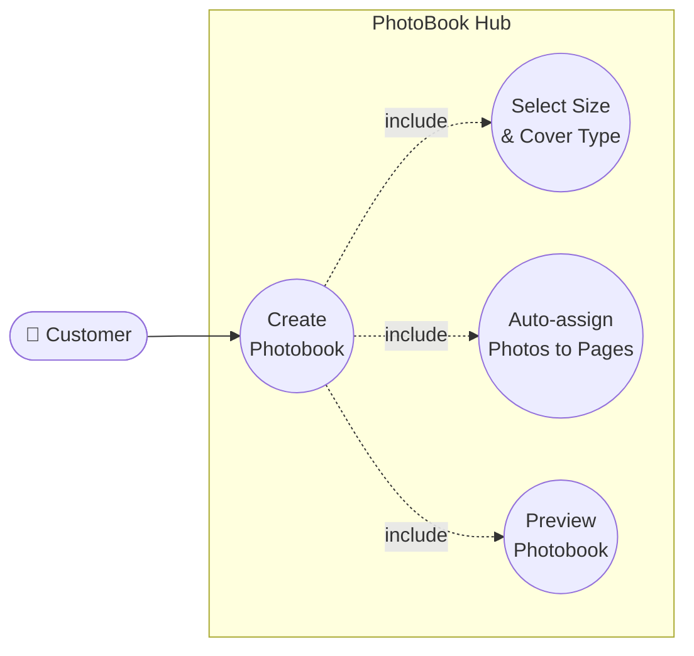
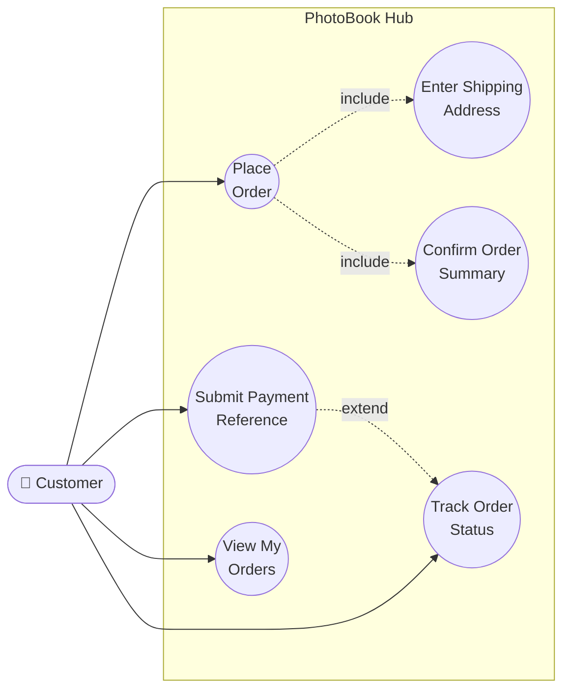
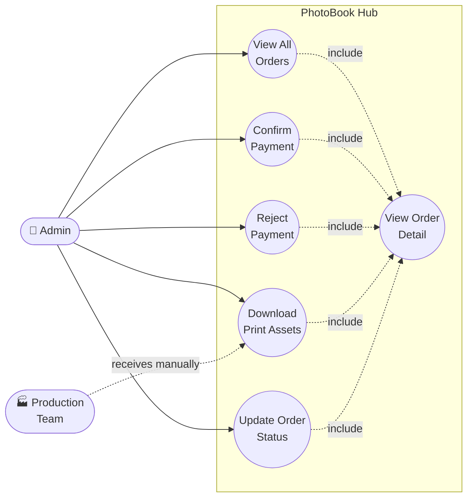

# Use Case Diagram — PhotoBook Hub

Renders natively in GitHub, VS Code (Markdown Preview), Notion, and Obsidian.

---

## Actor Overview

---

## Authentication

---

## Project & Photo Management

---

## Photobook Editor

---

## Order Placement

---

## Admin Panel

---

## Use Case Reference

| ID | Use Case | Actor | Domain |
|---|---|---|---|
| UC01 | Register | Guest | Authentication |
| UC02 | Login | Guest, Customer, Admin | Authentication |
| UC03 | Logout | Customer, Admin | Authentication |
| UC04 | Create Project | Customer | Project & Photos |
| UC05 | Upload Photos | Customer | Project & Photos |
| UC06 | View Photos | Customer | Project & Photos |
| UC07 | Delete Photo | Customer | Project & Photos |
| UC08 | Create Photobook | Customer | Photobook Editor |
| UC09 | Select Size & Cover Type | Customer | Photobook Editor |
| UC10 | Auto-assign Photos to Pages | Customer | Photobook Editor |
| UC11 | Preview Photobook | Customer | Photobook Editor |
| UC12 | Place Order | Customer | Order Placement |
| UC13 | Enter Shipping Address | Customer | Order Placement |
| UC14 | Confirm Order Summary | Customer | Order Placement |
| UC15 | Submit Payment Reference | Customer | Order Placement |
| UC16 | View My Orders | Customer | Order Placement |
| UC17 | Track Order Status | Customer | Order Placement |
| UC18 | View All Orders | Admin | Admin Panel |
| UC19 | View Order Detail | Admin | Admin Panel |
| UC20 | Confirm Payment | Admin | Admin Panel |
| UC21 | Reject Payment | Admin | Admin Panel |
| UC22 | Download Print Assets | Admin, Production Team | Admin Panel |
| UC23 | Update Order Status | Admin | Admin Panel |

---

## Relationship Legend

| Notation | Meaning |
|---|---|
| `——>` solid arrow | Actor initiates the use case |
| `- - ->` include | Base use case always triggers the included use case |
| `- - ->` extend | Extending use case adds optional behaviour to the base |
| `..>` dotted | External actor interaction outside the system |

---

## Out of Scope (MVP)

| Use Case | Reason |
|---|---|
| Social login | Excluded from MVP |
| Email verification | Excluded from MVP |
| AI layout generation | Excluded from MVP |
| Coupons and referrals | Excluded from MVP |
| Production team portal | Manual workflow — no system interface |
| Automated fulfillment | Excluded from MVP |
| Multi-language / multi-country | Excluded from MVP |
